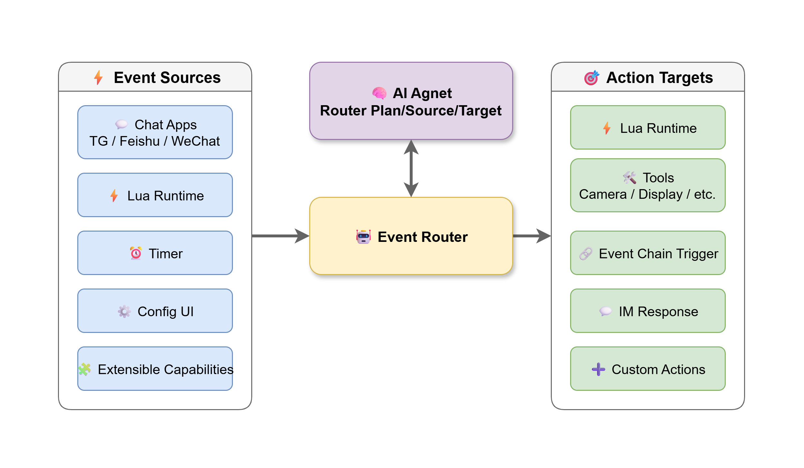

# ESP-Claw：物联网设备 AI 智能体框架


<p style="text-align: center;">
  <a href="./README.md">English</a> |
  <a href="./README_CN.md">中文</a> |
  <a href="./README_JP.md">日本語</a>
</p>

**ESP-Claw** 是面向物联网设备的 AI 智能体框架，通过组件化架构为开发者提供可复用的 AI 智能体能力与运行框架。在 OpenClaw 理念的基础上，ESP-Claw 增加了如下特性：

- **事件驱动：** 可由任意事件触发 Agent Loop 和其他动作，而不只是用户消息
- **Lua 运行时：** 由 LLM 主动规划硬件功能
- **结构化记忆管理：** 有条理地沉淀记忆内容
- **MCP 通讯：** 支持标准 MCP 设备与传统 IoT 设备接入
- **开箱即用：** 基于 Board Manager 快速配置，并提供一键烧录
- **组件化：** 所有模块均可按需裁剪


## 为什么 ESP-Claw: 从云中心化到边缘 AI 

当 ESP32 有了 Agent 大脑（思考、记忆与决策）为其搭配 LUA 小脑（协助运算与编排）、事件神经（实时响应）和 MCP 触角（感知与执行），端侧设备就不再是依赖云端的"提线木偶"，而是管理数据与决策的独立智能体。

- **去中心化：** 从“指令接收者”变为“边缘决策者”
- **协议标准化：** 以 MCP 消除“协议孤岛”
- **数据本地化：** 构建隐私的“物理屏障”
- **逻辑自主化：** 从“硬编码”转向“动态画布”

下图展示了 ESP-Claw 与 传统 IoT 设备的差异：

| **维度**    | **传统 IoT（云中心化）**        | **ESP-Claw（边缘 AI）**         |
| --------- | ----------------------- | --------------------------- |
| **核心场景**  | 设备联网与远程控制              | 物理世界感知、决策与控制                |
| **处理逻辑**  | 规则触发（If-This-Then-That）     | 外部事件 → 执行动作                 |
| **执行引擎**  | 规则引擎                    | LLM + Lua + Router（三级事件处理）  |
| **控制中心**  | 云端服务器                    | 边缘节点（ESP 芯片）                |
| **设备协议**  | MQTT / Matter / 私有 SDK     | MCP 统一语言 + 多协议桥接            |
| **设备间通讯** | 强依赖云中转                 | 本地直连 + MCP 抽象               |
| **记忆管理**  | 云端数据存储                 | 本地结构化记忆（JSONL + 标签）         |
| **交互方式**  | App / 控制面板        | IM（Telegram / 微信 / 飞书）      |
| **扩展性**   | 生态封闭，开发门槛高           | MCP Tool 即插即用               |
| **智能能力**  | 预设自动化                     | LLM + 本地规则（物理闭环）            |


## 事件路由：响应事件，驱动行为

不同于 OpenClaw 主要围绕用户消息进行响应的设计目标，嵌入式设备需要处理各类外部事件，因此对事件作出响应并完成决策，是 ESP-Claw 的核心能力。

设计中强化了被动执行器 **tool**，并将其扩展为 **capability**，与 LLM 进行无缝协同。**capability** 可以同时是事件的发出者和行为的执行者，例如：

- IM 可以传达用户的命令，调用 agent 处理并将结果通知给用户。
- MCP 接收传感器数据，调用 agent 对数据进行分析后，再调用 MCP 控制执行器。
- Lua 脚本调用 agent 进行分析后，将分析结果存到本地。

为了协调各类 **capability** 之间的事件与行为，系统内建了 **event router**，并由 agent 动态制定规则。



这样就可以灵活地完成各类任务，例如：

- 定时拍摄并同步到即时通讯软件
- 在传感器数据异常时调用大模型精准分析，并将报告发送到你手机

## Lua 运行时：自我蜕变

ESP-Claw 内嵌 Lua 解释器，由 agent 完成 Lua 脚本的编辑、调试与运行，使 ESP32 设备打破 C 语言预编码的限制，首次具备自我演进的可能。用户只需要一句话，ESP-Claw 即可自行生成动画或游戏、优化控制算法与参数，并且可以持续迭代。

同时，仓库中也为 Lua 提供了丰富的 C 预置外设与图形库驱动，供用户自由组合，以实现更高的效率和更多的玩法。

尝试以下功能：

- 接入一条灯带，让它帮你生成炫酷的灯效
- 让 Agent 生成一个像素风的小游戏
- 让你的平衡车自主迭代算法，让它跑得又快又稳
- 做一个调试器，让它替你采集日志，控制设备

## 本地记忆系统：越用越懂你

传统 AI Agent 的记忆通常局限于对话窗口，会话结束后就容易遗忘。ESP-Claw 在设备本地实现了完整的 **结构化长期记忆系统**：

**五类记忆：** 用户资料（`profile`）· 用户偏好（`preference`）· 事实知识（`fact`）· 设备事件（`event`）· 行为规则（`rule`）

**轻量级检索：** 不依赖向量数据库，而采用 **摘要标签** 机制。每条记忆附带 1-3 个关键词标签，请求时系统注入标签池，供 LLM 按需召回正文，从而在 MCU 有限资源下实现高效检索。

**自动进化：** 系统通过对话抽取、事件归档、行为规则沉淀三条链路持续积累记忆。更关键的是，LLM 能从中发现规律，并 **主动建议自动化**。

## 丰富外设接入：信息处理专家

ESP32 天然适合信息采集、分析、传输与执行等任务。ESP-Claw 同样支持接入摄像头、麦克风以及其他各类传感器，大部分驱动均可通过 ESP-IDF Component Registry 获取，选择对应驱动后即可快速接入。这样一来，设备便能够听见声音、观察世界。此外，ESP-Claw 还提供了 TTS（文本转语音）组件，使它能够在合适的时机提醒你，或者替你播放你想听的歌曲。

## MCP 统一协议：让设备成为 AI 原生对象

MCP（Model Context Protocol）是 ESP-Claw 的统一设备语言。网关的核心职责是对上层 Agent **屏蔽全部协议差异**，Agent 所见的始终是标准化的 MCP Tool 列表。

**设备接入三步链路：**

1. **发现** — 设备上电后通过 BLE ADV 零连接广播能力信息（WiFi 设备通过 mDNS 补充），网关被动捕获即完成识别
2. **注册** — 网关拉取设备自带的 JSON Manifest，自动生成 MCP Tool 并注册到 Tool 列表，OTA 升级后增量刷新
3. **执行** — AI 通过标准 MCP Tool Call 下发指令；设备执行后 10ms 内更新 ADV 广播，网关捕获状态变更通过 SSE 推送 Agent，端到端 50–220ms

**兼容存量设备：** 对不支持 MCP 的 Legacy 设备（Zigbee/Thread），网关内部为其挂载 **Shadow Server**（虚拟 MCP Server），通过 Lua 驱动完成协议转译——新增协议只需实现标准 `device_driver_t` 接口并注册，核心模块不变。

**AI 原生语义接口：** 工具命名采用动词-名词结构（`turn_on`、`get_temperature`），返回值携带单位与新鲜度元信息，AI 无需外部文档即可理解和调用。当所有设备以统一 MCP Tool 形式存在，AI 可跨设备多步编排，产生**工具组合的涌现能力**。

## 离线可用

自动化系统、Lua 运行时等在网络断开时仍然可以正常工作，而且支持 **断电恢复**。你可以为它派发指定任务，让它在特定环境中安静、可靠地执行工作：

- 人流统计：通过本地 AI 识别人脸并统计经过的人数
- 自动化网关：由 Agent 预设离线命令词与唤醒词，提供稳定的降级控制

## 专注于特定工作

ESP-Claw 包含了完整的 OpenClaw 工作流。相比运行在 PC 端的各类 Claw，它在很多场景中能够 **更专注地** 完成你所指派的任务。同时，借助记忆系统，它还能持续地跟随你的使用习惯不断演进。你可以尝试将它接入自己最常用的即时通讯软件，体验它对你的持续了解与成长。**不必担心隐私问题**，所有记忆都会存储在本地。

你可以让它帮你完成这些事情：

- 安装在你的水杯上，通过传感器了解并统计你每天的饮水量
- 陪伴你养成习惯，比如阅读或健身
- 作为你的花草养育师，统计和管理水肥，观察植物的心情

## 代码架构

项目采用 **“应用示例 + 通用组件”** 的组织方式：`application/basic_demo` 是可直接编译运行的 ESP-IDF 示例工程，负责把 Wi-Fi、配置页面、Lua 模块和各类能力组装成一个完整设备；`components` 则沉淀可复用的运行时核心、能力插件和硬件/脚本扩展模块，便于后续在不同板型和场景下复用。

当前代码可以分为四层：

- **应用装配层：** `application/basic_demo/main`，负责启动入口、网络连接、参数配置、HTTP 配网页面以及 Demo 级模块注册。
- **能力层：** `components/claw_capabilities`，负责对外能力封装，包括 IM 通讯、MCP Client/Server、Lua 运行时、调度、文件、时间、Web 搜索等能力。
- **运行时核心层：** `components/claw_modules`，负责 Agent 基础设施，包括核心上下文、能力注册、事件路由、记忆管理与技能管理等。
- **设备与脚本扩展层：** `components/lua_modules`，负责把显示屏、摄像头、音频、按键、GPIO、存储等外设能力暴露给 Lua 和上层 Agent 使用。

当前仓库的主要目录结构如下：

```text
esp-claw/
├── application/
│   └── basic_demo/
│       ├── main/
│       │   ├── main.c                    # Firmware entry
│       │   ├── app_claw.c                # App bootstrap and assembly
│       │   ├── basic_demo_wifi.*         # Wi-Fi connection and network setup
│       │   ├── basic_demo_settings.*     # Local settings persistence
│       │   ├── config_http_server.*      # Web configuration service
│       │   ├── basic_demo_lua_modules.*  # Lua module registration
│       │   └── web/                      # Frontend assets for device config
│       └── README.md
├── components/
│   ├── claw_modules/
│   │   ├── claw_core/          # Core runtime context
│   │   ├── claw_cap/           # Capability abstraction and registration
│   │   ├── claw_event_router/  # Deterministic event routing
│   │   ├── claw_memory/        # Structured memory management
│   │   └── claw_skill/         # Skill metadata and loading
│   ├── claw_capabilities/
│   │   ├── cap_im_feishu / cap_im_qq / cap_im_tg / cap_im_wechat
│   │   ├── cap_mcp_client / cap_mcp_server
│   │   ├── cap_lua / cap_skill_mgr / cap_scheduler / cap_router_mgr
│   │   ├── cap_files / cap_time / cap_web_search / cap_cli
│   │   └── ...                 # More agent-facing capabilities
│   └── lua_modules/
│       ├── lua_module_display / lua_module_camera / lua_module_audio
│       ├── lua_module_button / lua_module_gpio / lua_module_led_strip
│       ├── lua_module_storage / lua_module_delay / lua_module_event_publisher
│       └── esp_painter         # Lightweight drawing support
├── docs/                       # Images and supplementary docs
├── README.md
└── README_CN.md
```

## 如何部署使用

### 开箱即用

通过网页即可完成配置与固件获取，无需额外编译固件或安装任何软件，即可开始烧录与使用。
依托 ESP-BoardManager 的模块化架构，项目可适配并切换多种开发板配置。

### 通过源码编译

[`basic_demo`](./application/basic_demo) 提供了基础示例。关于编译与烧录的详细说明，请参考其 [README](./application/basic_demo/README.md)。

### 注意事项

- 当前项目仍处于开发阶段，如果遇到问题，欢迎随时提交 issue。
- 自编程等功能依赖高推理模型的能力，推荐选用 GPT-5.4 或类似性能模型以取得最佳体验。

## 关注我们

如果这个项目对您有所启发和帮助，欢迎点亮一颗星！⭐⭐⭐⭐⭐

您的支持永远是我们更新的最大动力！

## 致谢

灵感来自 [OpenClaw](https://github.com/openclaw/openclaw)。

Agent Loop 和 IM 通讯等功能在 ESP32 上的实现参考了 [MimiClaw](https://github.com/memovai/mimiclaw)。

MimiClaw 同时也揭示了在 ESP32-S3 上运行 OpenClaw 的可行性。
